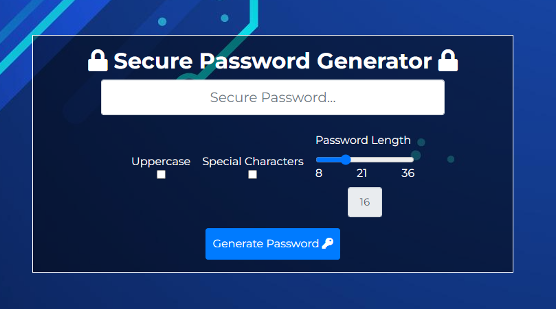
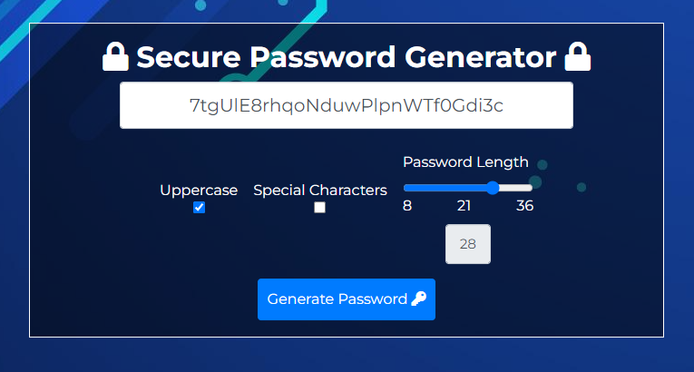
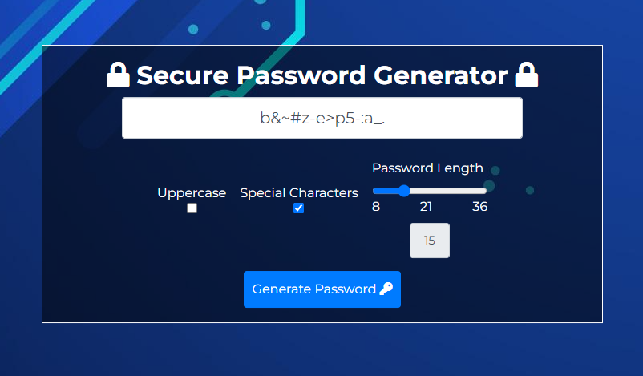
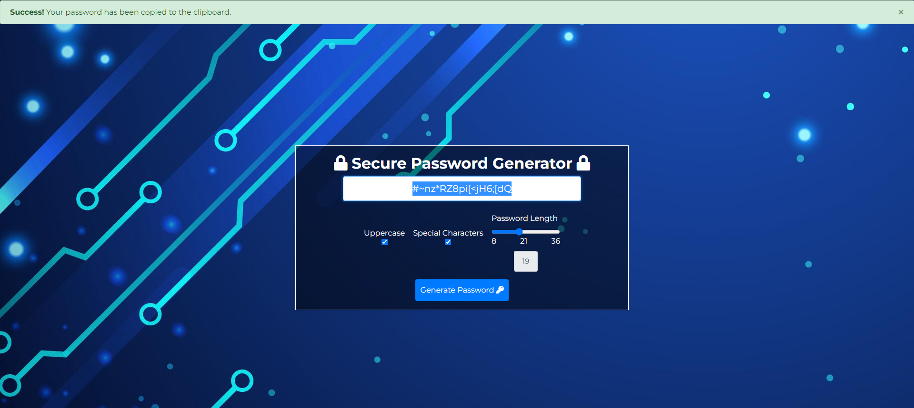

# Secure Password Generator

A simple password generator made with HTML, CSS and JavaScript. 

## Usage & Features

* Generates a password with a length of 8-36 characters by default.
* The password is generated randomly and is not stored anywhere. 
* Copy the password to your clipboard by clicking the password in the box. 
* Generate a new password by clicking the "Generate Password" button.
* Choose to include numbers, symbols and uppercase letters.

## Code

The password is generated by using the `Math.floor()` & `Math.random()` functions to generate a random number between the minimum and maximum values which are 8 and 36. The password is then generated by using the `Shuffle()` function that takes in a string and shuffles it. The `Shuffle()` function is defined as follows: 

```javascript
    function Shuffle(string) {
        var array = string.split('');
        var currentIndex = array.length, temporaryValue, randomIndex;

        // While there remain elements to shuffle...
        while (0 !== currentIndex) {
            // Pick a remaining element...
            randomIndex = Math.floor(Math.random() * currentIndex);
            currentIndex -= 1;
            // And swap it with the current element.
            temporaryValue = array[currentIndex];
            array[currentIndex] = array[randomIndex];
            array[randomIndex] = temporaryValue;
        }

        return array.join('');
    }
```
The argument is a dictionary of all the characters that can be used to generate the password. The `Shuffle()` function is used to shuffle the dictionary and then the first `length` characters are returned.


The usage of each character is determined by the user's choice that is deciphered by the checkboxes. The user can choose to include uppercase letters, lowercase letters, numbers and symbols. The user can also choose the length of the password. The user's choices are stored in an object called `options`. The `options` object is defined as follows:

```javascript
    var characters = {
    lowercase: 'abcdefghijklmnopqrstuvwxyz',
    uppercase: 'ABCDEFGHIJKLMNOPQRSTUVWXYZ',
    numbers: '0123456789',
    symbols: '!@#$%^&*()_+~`|}{[]\:;?><,./-=',
};
```


```javascript
    if (uppercaseCheck == true) {
        charactersToUse += characters.uppercase;
    }

    if (specialCharactersCheck == true) {
        charactersToUse += characters.symbols;
    }
```

## Screenshots
Home Page  



Uppercase  



Special Characters  



Copied to Clipboard  



## Credits

* [Bootstrap](https://getbootstrap.com/)
* [Font Awesome](https://fontawesome.com/)
* [Google Fonts](https://fonts.google.com/)
* [jQuery](https://jquery.com/)

## Contributers

[Alexander Sanderson](https://github.com/Vexelior)
